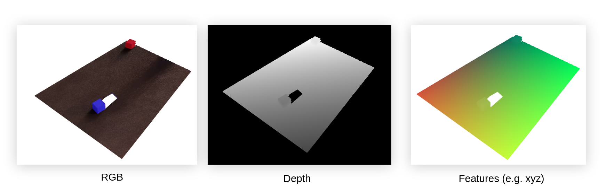

## Point Renderer
A minimal, lightweight CUDA-accelerated renderer of pointclouds.

<div align="center"></div>

### Install

```
pip install -r requirements.txt
pip install -e .
```

### Run

**Load Data** 
Extract included pcd_data.tar.gz

```
import numpy as np

data = np.load("pcd_data/w1280_h720/3.npy", allow_pickle=True)
data = data[None][0]
pc = data["pc"]
rgb = data["img_feat"]
```

**Render the image** 

```
# Make the renderer
from point_renderer.renderer import PointRenderer
renderer = PointRenderer(device="cuda", perf_timer=False)

# Define a batch of cameras
img_size = (512, 512)
K = renderer.get_camera_intrinsics(hfov=70, img_size=img_size)
camera_poses = renderer.get_batch_of_camera_poses(
    cam_positions=[[1.5, 1.5, 1.5],[-1.5, -1.5, -1.5]],
    cam_lookats=[[0.0, 0.0, 0.0],[0.0, 0.0, 0.0]])

# Render the pointcloud from the given cameras
images, depths = renderer.render_batch(pc, rgb, camera_poses, K, img_size, 
                                       default_color=1.0, 
                                       splat_radius=0.005,
                                       aa_factor=2
                                      )

# Show the results
plt.imshow(images[0].detach().cpu().numpy()); plt.show()
plt.imshow(depths[0].detach().cpu().numpy()); plt.show()
plt.imshow(images[1].detach().cpu().numpy()); plt.show()
plt.imshow(depths[1].detach().cpu().numpy()); plt.show()
```

.. Or run the jupyter notebook that has this same code above, and also all the benchmarks.
